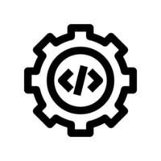

Ahmed Mohamed Khalifa - Portfolio Website 🚀

  

    

🌐 Live Demo
View Live Portfolio

📋 About
A modern, responsive, and animated single-page portfolio website built to showcase my skills, projects, and experience as a Back-End Developer specializing in Node.js, Express, and MongoDB.

This portfolio features a sleek dark theme, smooth scroll animations, typing effects, and a fully responsive design that works beautifully on all devices.

✨ Features
Feature	Description
🌙 Dark Theme	Modern dark UI with green accent colors
✍️ Typing Animation	Dynamic role typing effect in the hero section
🎭 Scroll Animations	Fade-in, slide, and scale animations on scroll
📊 Skill Bars	Animated progress bars for each technology
📱 Fully Responsive	Optimized for mobile, tablet, and desktop
🍔 Mobile Menu	Smooth hamburger navigation for mobile devices
🔝 Scroll Progress	Top progress bar showing scroll position
⬆️ Back to Top	Floating button to quickly return to top
📬 Contact Form	Functional contact form with validation
🎯 SEO Optimized	Meta tags, Open Graph, and semantic HTML
🛠️ Tech Stack
Frontend
HTML5 - Semantic markup
CSS3 - Custom properties, Grid, Flexbox, Animations
JavaScript (Vanilla) - DOM manipulation, Intersection Observer, Events
Backend
Node.js - Runtime environment
Express.js - Web server framework
Design
Inter - Primary font family
JetBrains Mono - Monospace font for accents
📁 Project Structure
Personal_Prtfolio_App/ ├── index.html # Single-page portfolio (all sections) ├── css/ │ └── style.css # Complete stylesheet ├── js/ │ └── main.js # All animations & interactions ├── images/ # All project images & assets │ ├── SDE.png │ ├── personal image.png.jpeg │ ├── chattapp.png │ ├── weather.png │ ├── movieapp.png │ ├── personalprotfolio.png │ ├── webdev.png │ ├── backend.png │ ├── Database.png │ ├── C++.png │ ├── python.png │ ├── linkedin.png │ ├── github.png │ ├── youtube.png │ └── x.png ├── server.js # Express server (single-page routing) └── package.json # Project configuration

🚀 Getting Started
Prerequisites
Node.js (v18 or higher)
Installation
Clone the repository
git clone https://github.com/khalifacastaway11/Personal_Prtfolio_App.git
cd Personal_Prtfolio_App

2-Install dependencies
npm install

3-Run the development server
npm start

4-Open in browser
http://localhost:3000